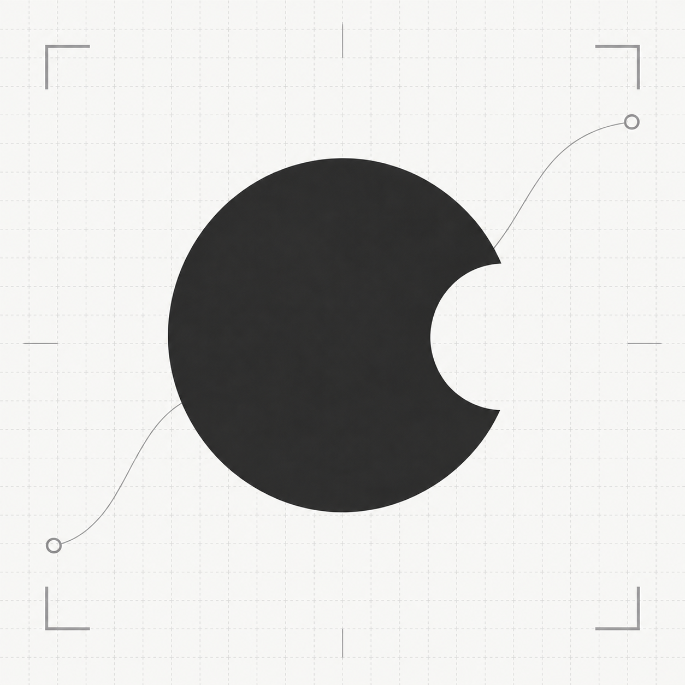
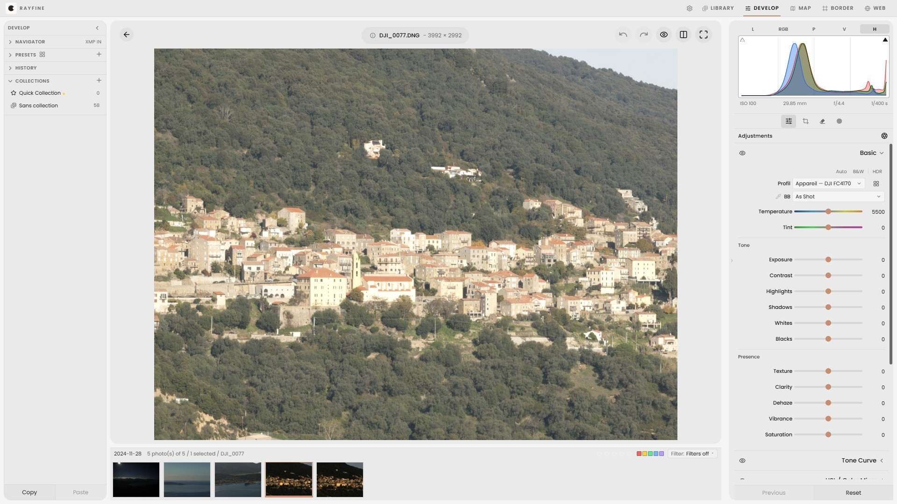

<p align="center">
  
</p>

<h1 align="center">Rayfine</h1>

<p align="center">
  A fast, non-destructive, GPU-accelerated RAW editor with a Lightroom Classic–style workflow.<br>
  Based on <a href="https://github.com/CyberTimon/RapidRAW">RapidRAW</a>.
</p>

<div align="center">

[](https://github.com/RandazzoMaxime/Rayfine/releases/latest)
[](https://github.com/RandazzoMaxime/Rayfine/releases/latest)
[](LICENSE)
<br>
[](https://www.rust-lang.org/)
[](https://wgpu.rs/)
[](https://react.dev/)
[](https://tauri.app/)

</div>

<p align="center">
  
</p>

## About

Rayfine is a fork of [RapidRAW](https://github.com/CyberTimon/RapidRAW) by Timon Käch. It keeps RapidRAW's
Rust + wgpu processing core and reshapes the app around a Lightroom Classic–style workflow: a catalog with
collections, distinct Library and Develop modules, and Develop panels that follow Lightroom's layout and
behaviour.

## Highlights

- **Library & catalog** — collections, Quick Collection, imports grouped by disk with duplicate checks,
  filmstrip, grid and loupe views.
- **Develop** — Basic panel with camera-matching profiles, point tone curve, HSL / Color Mixer, Color
  Grading, Details, Effects (glow, halation), Lens Corrections and Transform with a guide tool, crop.
- **Masking** — brush, linear and radial gradients, color/luminance range and AI subject/sky masks, with
  a floating mask list and Lightroom-style mask menus.
- **Real-time preview** — native wgpu rendering, a full-resolution dynamic preview when zoomed in, and
  neighbouring photos prefetched so stepping through a shoot stays instant.
- **Non-destructive** — edits live in `.rrdata` sidecars next to your files; XMP import from Lightroom.
- **In-app updates** — signed updates delivered from this repository's releases.

## Download

Get the installer for Windows or macOS from the [**latest release**](https://github.com/RandazzoMaxime/Rayfine/releases/latest).
Once installed, Rayfine offers new versions by itself.

> macOS builds are not signed by Apple yet: if macOS blocks the first launch, allow it in
> **System Settings → Privacy & Security** (Open Anyway).

## Build from source

You need [Rust](https://www.rust-lang.org/tools/install) and [Node.js](https://nodejs.org/).

```bash
git clone https://github.com/RandazzoMaxime/Rayfine.git
cd Rayfine
npm install
npm start
```

## Command line export

Rayfine can export without opening the interface, applying the edits stored in `.rrdata` sidecars:

```bash
# Export a folder
Rayfine export /path/to/photos --output /path/to/output_dir --format jpeg --quality 90

# Export one image to a specific file
Rayfine export /path/to/photo.raw --output /path/to/output.png --format png

# Override sidecars with an adjustments JSON file
Rayfine export /path/to/photos --output /path/to/output_dir --adjustments /path/to/preset.json
```

| Option                 | Description                                                          | Default           |
| :--------------------- | :------------------------------------------------------------------- | :---------------- |
| `<source>`             | Image file or directory                                              | _(Required)_      |
| `--output <path>`      | Target directory or output file                                      | _(Required)_      |
| `--format <fmt>`       | `jpeg`, `png`, `webp`, `avif`, `tiff`, `jxl`, `cube`                 | `jpeg`            |
| `--quality <1-100>`    | Export quality                                                       | `90`              |
| `--keep-metadata`      | Keep EXIF/capture metadata                                           | `false`           |
| `--adjustments <path>` | Adjustments JSON that overrides sidecars                             | _(Auto-detected)_ |

## System requirements

- **Windows** 10 or newer, **macOS** 13 (Ventura) or newer.
- **16 GB of RAM** recommended for high-resolution RAW files.
- **A dedicated GPU** recommended: the whole processing pipeline runs on the GPU.

## Credits

Rayfine is built on [**RapidRAW**](https://github.com/CyberTimon/RapidRAW) by Timon Käch — thank you for the
editor, its processing pipeline and the community around it.

It also relies on [rawler](https://github.com/dnglab/dnglab/tree/main/rawler) for RAW decoding,
[lensfun](https://lensfun.github.io/) for lens corrections, [LaMa](https://github.com/advimman/lama) for
inpainting, [SAM 2](https://github.com/facebookresearch/sam2) and [U-2-Net](https://github.com/xuebinqin/U-2-Net)
for AI masks, [Depth Anything V2](https://github.com/DepthAnything/Depth-Anything-V2) for depth masks and
[nind-denoise](https://github.com/trougnouf/nind-denoise) for AI noise reduction.

## License

Rayfine, like RapidRAW, is licensed under the **GNU Affero General Public License v3.0**. See [LICENSE](LICENSE).
